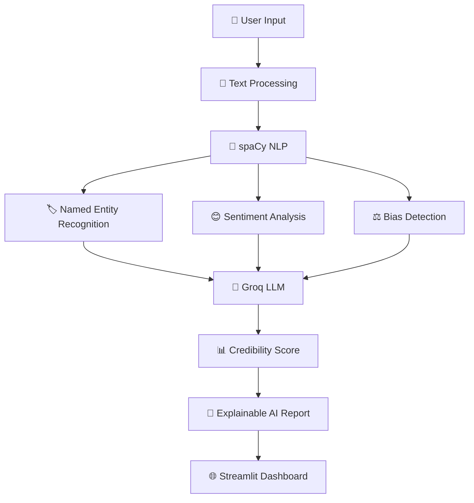

<div align="center">


<p align="center">


</p>

<p align="center">


</p>

---

## 🌟 AI Powered Fact Verification Platform

**FactShield** is an intelligent misinformation detection platform that leverages **Large Language Models (LLMs)** and **Natural Language Processing (NLP)** to verify claims, identify misinformation, analyze sentiment, and detect hidden bias.

Designed to assist users in evaluating the credibility of online content, FactShield combines modern AI models with linguistic analysis to generate transparent and explainable verification results.

---

# ✨ Features

🔍 AI Fact Verification

🧠 Natural Language Processing

⚖️ Political & Emotional Bias Detection

📊 Credibility Score Generation

😊 Sentiment Analysis

🏷 Named Entity Recognition

📑 AI Generated Explanations

⚡ High-Speed Processing

💾 Intelligent Response Caching

🔒 Secure API Handling

---

# 🚀 Technology Stack

| Category | Technology |
|-----------|------------|
| Language | Python |
| Framework | Streamlit |
| LLM | Groq Llama 3 |
| NLP | spaCy |
| AI Models | Hugging Face Transformers |
| Sentiment | TextBlob |
| API | Requests |
| Cache | JSON |

---

# 🧠 AI Workflow



---

# ⚡ Key Capabilities

✔ Fact Verification

✔ Misinformation Detection

✔ Bias Classification

✔ Sentiment Analysis

✔ Named Entity Recognition

✔ Explainable AI

✔ Fast Response Time

✔ Intelligent Cache

✔ REST API Integration

---

# 📂 Project Structure

```text
FACT-SHIELD

│

├── factshield.py

├── requirements.txt

├── cache/

├── assets/

└── README.md
```

---

# ⚙ Installation

### Clone Repository

```bash
git clone https://github.com/HARIESHSARAVANAN/FACT-SHIELD.git
```

### Navigate

```bash
cd FACT-SHIELD
```

### Install Dependencies

```bash
pip install -r requirements.txt
```

### Run Application

```bash
streamlit run factshield.py
```

---

# 🎯 Why FactShield?

Modern misinformation spreads faster than ever.

FactShield helps users evaluate information by combining:

- Artificial Intelligence
- Natural Language Processing
- Large Language Models
- Explainable AI
- Sentiment Analysis
- Bias Detection

into one intelligent verification platform.

---

# 🔮 Future Enhancements

🌍 Live News Verification

📄 PDF Fact Checking

🎙 Voice Claim Analysis

🌐 Browser Extension

📱 Mobile Application

📈 Interactive Analytics

☁ Cloud Deployment

🌎 Multi-Language Support

🤖 Multi-LLM Comparison

---

# 🤝 Contributing

Contributions are welcome!

```text
🍴 Fork Repository

🌿 Create Feature Branch

💻 Commit Changes

🚀 Push Changes

🎉 Open Pull Request
```

---

# 👨‍💻 Author

<div align="center">

## Hariesh Saravanan

**AI Engineer • Machine Learning • NLP • Cybersecurity**

<a href="https://github.com/HARIESHSARAVANAN">


</a>

</div>

---

<div align="center">

### ⭐ If you found this project useful, consider giving it a Star!


</div>
